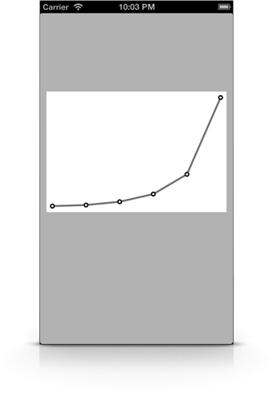
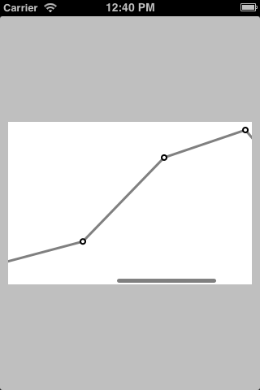

# FDGraphView

`FDGraphView` is an UIView subclass I created for [Libretto](http://librettoapp.net). It was built using the CoreGraphics’ APIs.

## Usage

### FDGraphView

Add `FDGraphView.{h,m}` to your project, import the header where you want to use this component and here you go:

    FDGraphView *graphView = [[FDGraphView alloc] initWithFrame:CGRectMake(10, 130, 300, 200)];
    
    graphView.dataPoints = @[@1, @2, @5, @12, @30, @100];
    
    [self.view addSubview:graphView];

A few style-related options are available, look in the header file.

    // Style
    @property (nonatomic) UIEdgeInsets edgeInsets;
    @property (nonatomic) CGFloat dataPointsXoffset;
    // -- colors
    @property (nonatomic, strong) UIColor *dataPointColor;
    @property (nonatomic, strong) UIColor *dataPointStrokeColor;
    @property (nonatomic, strong) UIColor *linesColor;

### FDGraphScrollView

This is a subclass of `UIScrollView` that serves as a wrapper around `FDGraphView`.

Add `FDGraphScrollView.{h,m}` to your project, import the header where you want to use the component:

    FDGraphScrollView *scrollView = [[FDGraphScrollView alloc] initWithFrame:CGRectMake(10, 130, 300, 200)];
    
    // data
    scrollView.dataPoints = @[@1, @2, @5, @12, @30, @100, @123, @44];
    
    [self.view addSubview:scrollView];

This is the result:

## TODO

If you want to help here are some ideas:

- [ ] Add more styling options
- [x] Create an UIScrollView wrapper to display larger data sets

## LICENSE

MIT: use it however you want.
